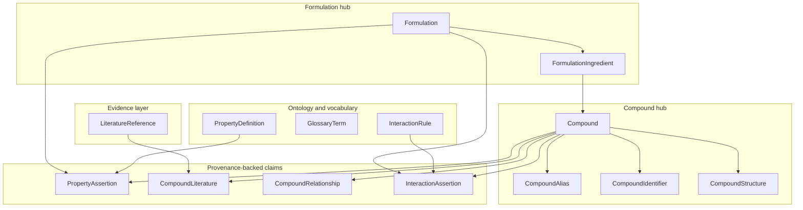
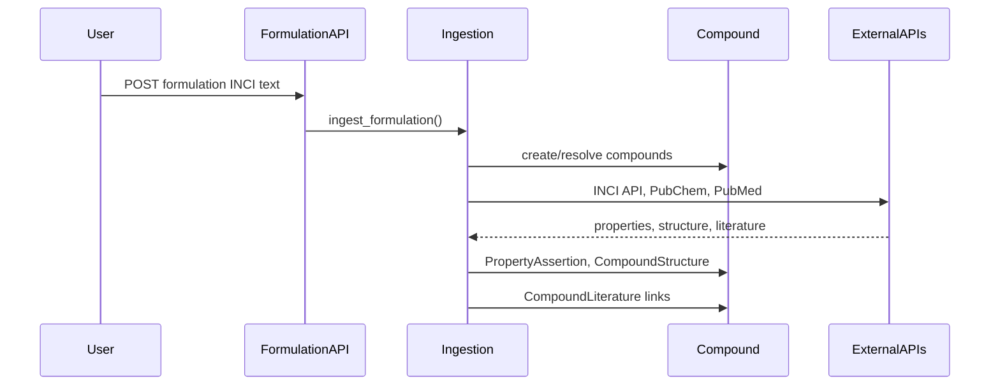

# Blueskies data model diagram

All persistent domain models live under [`backend/core/models/`](backend/core/models/). There is no local DB layer for `skincareApi` — that module is an external HTTP proxy only.

## High-level architecture

## Full ER diagram

```mermaid
erDiagram
    Compound ||--o{ CompoundAlias : aliases
    Compound ||--o{ CompoundIdentifier : identifiers
    Compound ||--o| CompoundStructure : structure

    Formulation ||--o{ FormulationIngredient : ingredients
    Compound ||--o{ FormulationIngredient : "resolved as"

    PropertyDefinition ||--o{ PropertyAssertion : assertions
    Compound ||--o{ PropertyAssertion : "claims on"
    Formulation ||--o{ PropertyAssertion : "claims on"
    PropertyAssertion ||--o| PropertyAssertion : superseded_by

    LiteratureReference ||--o{ CompoundLiterature : cited_in
    Compound ||--o{ CompoundLiterature : literature_links

    Compound ||--o{ CompoundRelationship : relationships_as_a
    Compound ||--o{ CompoundRelationship : relationships_as_b

    InteractionRule ||--o{ InteractionAssertion : spawned_by
    Formulation ||--o{ InteractionAssertion : in_context
    Compound ||--o{ InteractionAssertion : interactions_as_a
    Compound ||--o{ InteractionAssertion : interactions_as_b

    Compound {
        string canonical_inci UK
        string display_name
        string entity_type
        string primary_cas
        bool structure_resolvable
        string enrichment_status
        text notes
    }

    CompoundAlias {
        string alias_text
        string alias_type
        string source
    }

    CompoundIdentifier {
        string id_type
        string id_value
        string source
        bool is_primary
    }

    CompoundStructure {
        text smiles
        text inchi
        string inchikey
        string molecular_formula
        float molecular_weight
        string match_quality
    }

    Formulation {
        string name
        string brand
        string sku
        string barcode UK
        string enrichment_status
        text raw_inci_text
    }

    FormulationIngredient {
        int position
        string raw_text
        string parse_status
    }

    PropertyDefinition {
        slug key UK
        string domain
        string value_type
        json allowed_values
        string label
        text description
        bool is_agent_writable
    }

    PropertyAssertion {
        string value_text
        float value_numeric
        bool value_bool
        json value_json
        bool is_active
        string source_type
        string source_ref
        float confidence
    }

    GlossaryTerm {
        string term UK
        slug slug UK
        string category
        text definition
        json related_property_keys
    }

    LiteratureReference {
        string pmid UK
        text title
        text abstract
        string journal
        int year
        string doi
        json mesh_terms
    }

    CompoundLiterature {
        string relevance_category
        string role_in_paper
        int relationship_degree
        float confidence
        string enrichment_status
    }

    CompoundRelationship {
        string relationship_type
        int degree
        float confidence
    }

    InteractionRule {
        slug key UK
        string pattern_a
        string pattern_b
        string interaction_type
        string risk_class
        string severity
    }

    InteractionAssertion {
        string vehicle_context
        string interaction_type
        string risk_class
        string severity
        text mitigation
        bool is_active
    }
```

## Provenance inheritance

Three claim models inherit from the abstract [`SourceMetadata`](backend/core/models/metadata.py) mixin (not a table itself):

| Model | Inherits provenance | Attached to |
|-------|---------------------|-------------|
| `PropertyAssertion` | yes | `Compound` **or** `Formulation` (exactly one) |
| `CompoundLiterature` | yes | `Compound` + `LiteratureReference` |
| `CompoundRelationship` | yes | `Compound` (pair: `compound_a`, `compound_b`) |
| `InteractionAssertion` | yes | `Compound`(s) + optional `Formulation` + optional `InteractionRule` |

Shared provenance fields on each: `source_type`, `source_name`, `source_ref`, `source_url`, `confidence`, `evidence_summary`, `asserted_by`, `retrieved_at`.

## Key constraints and design choices

- **Compound** is the central ingredient identity (`canonical_inci` unique).
- **FormulationIngredient** links a product INCI list position to an optional resolved **Compound** (`SET_NULL` on delete).
- **PropertyAssertion** enforces exactly one target (`compound` XOR `formulation`) via `clean()`.
- **PropertyAssertion** supports versioning via `superseded_by` self-FK.
- **CompoundLiterature** is unique per `(compound, literature)` pair.
- **CompoundRelationship** is unique per `(compound_a, compound_b, relationship_type)`.
- **GlossaryTerm** and **PropertyDefinition** are standalone vocabulary; linked loosely via JSON `related_property_keys` / `glossary_categories`.
- **InteractionRule** is seed data; **InteractionAssertion** records rule matches or inferred interactions in a formulation context.

## Model file map

| File | Models |
|------|--------|
| [`compound.py`](backend/core/models/compound.py) | `Compound`, `CompoundAlias`, `CompoundIdentifier`, `CompoundStructure` |
| [`formulation.py`](backend/core/models/formulation.py) | `Formulation`, `FormulationIngredient` |
| [`properties.py`](backend/core/models/properties.py) | `PropertyDefinition`, `PropertyAssertion`, `GlossaryTerm` |
| [`literature.py`](backend/core/models/literature.py) | `LiteratureReference`, `CompoundLiterature`, `CompoundRelationship` |
| [`interactions.py`](backend/core/models/interactions.py) | `InteractionRule`, `InteractionAssertion` |
| [`metadata.py`](backend/core/models/metadata.py) | `SourceMetadata` (abstract), `SourceType` enum |

## Data flow (how models get populated)

Ingestion paths: [`formulation_ingest.py`](backend/core/ingestion/formulation_ingest.py), [`inci_ingest.py`](backend/core/ingestion/inci_ingest.py), [`ingest.py`](backend/core/ingestion/ingest.py).
